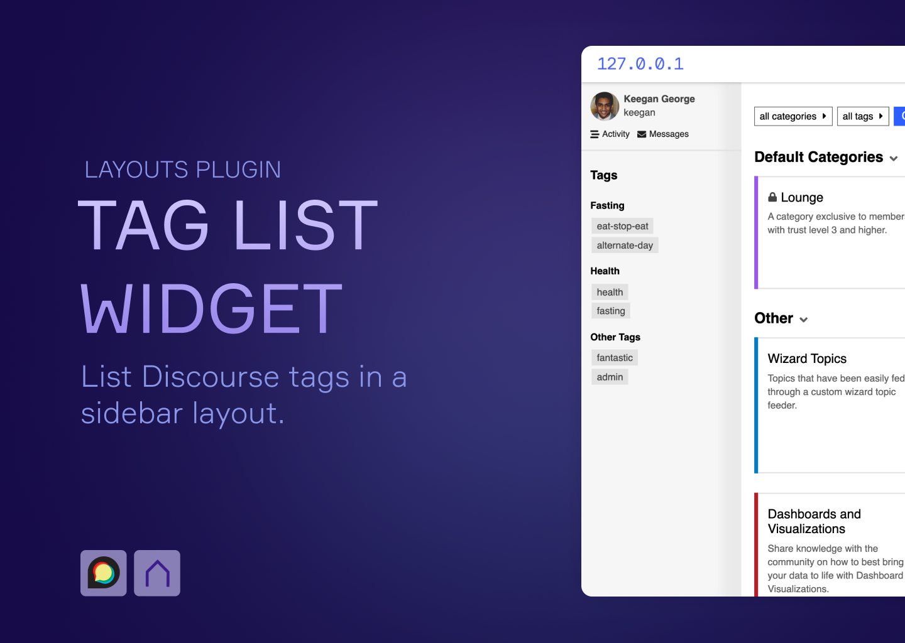
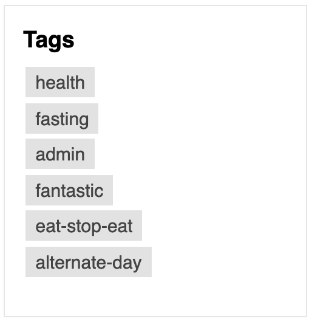
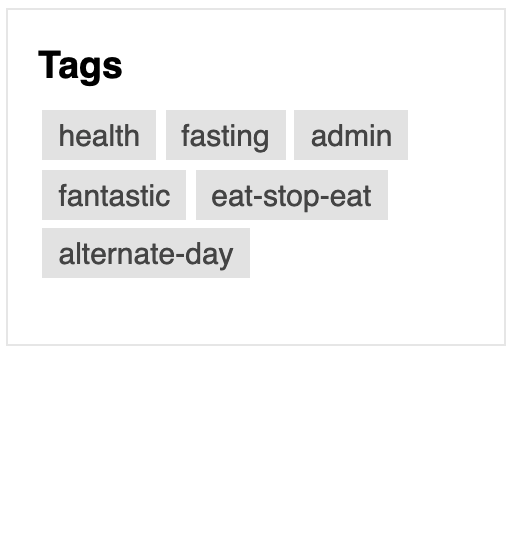
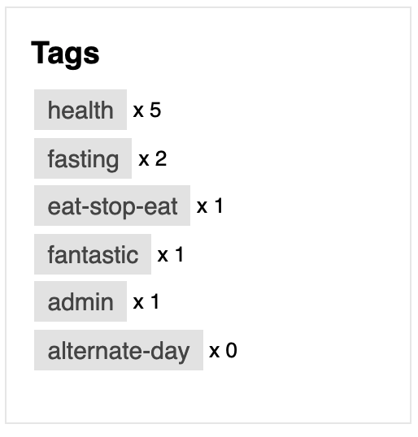

# 🏷️ Layouts Tag List Widget

## 🔍 Overview

The Tag List Component allows you to display tags from Discourse in a sidebar using [Bars!](https://meta.discourse.org/t/discourse-bars-a-sidebar-framework/298216) or Discourse's Right Sidebar Blocks Component.

> ⚠️ **Please ensure that you have tagging enabled in your Discourse settings for this widget to work.**

## 🔗 Info &amp; Links

| Title                 | Link                                                                              |
| --------------------- | --------------------------------------------------------------------------------- |
| ⚙️ **Component**      | [Tag List Component](https://github.com/paviliondev/bars-tag-list-widget) |
| 🔌 **Base Plugin**    | [Bars!](https://meta.discourse.org/t/discourse-bars-a-sidebar-framework/298216) |
| 👨‍💻 **Author**         | [Keegan George](https://github.com/keegangeorge/), [Merefield](https://github.com/merefield/)|
| #️⃣ **Version**        | `2.0.0`                                                                           |

## ⚙️ Settings

There are a couple settings that you can configure to customize how the tag list widget appears in the layout.

### 🙈 Hidden Tags

Select tags from the dropdown you wish to have hidden from the sidebar.

### 📄 Display Style

Select between a column or row style layout to display your tags.

| Column                               | Row                             |
| ------------------------------------ | ------------------------------- |
|  |  |

### #️⃣ Show Count

Toggling this setting will display the number of topics for each tag beside the tag item.

### 📶 Sort Type

Select the manner in which tags should be sorted.

Options include:

- Count Ascending
- Count Descending
- Alphabetical Ascending
- Alphabetical Descending
